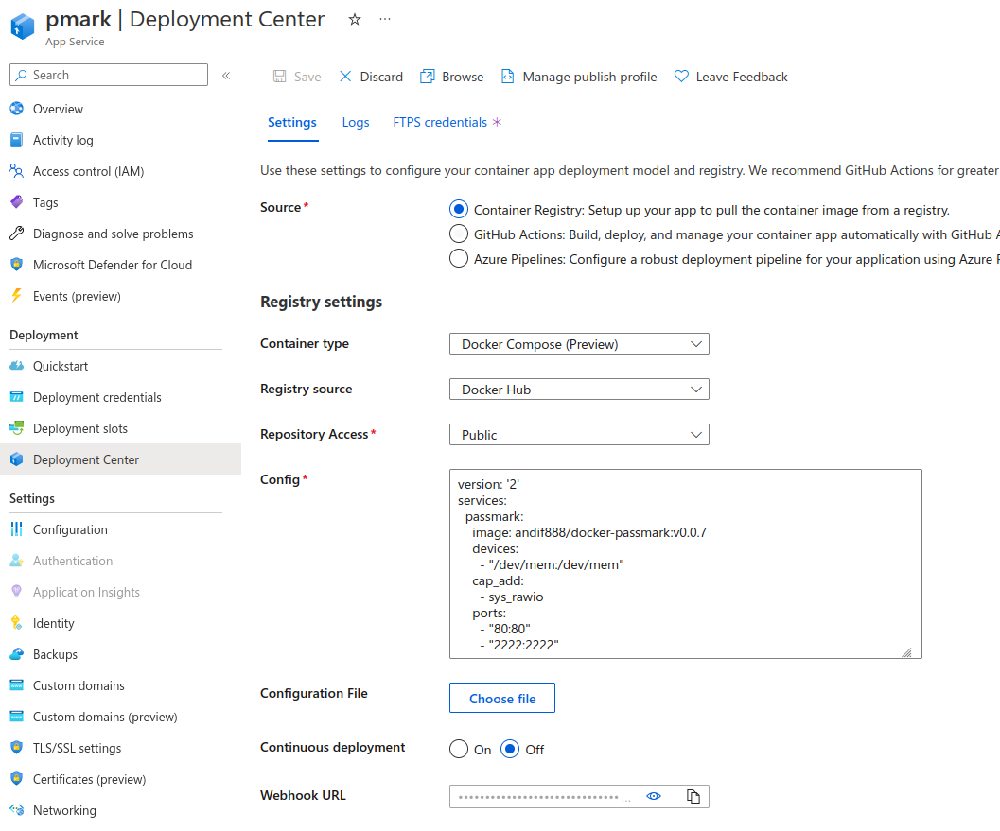
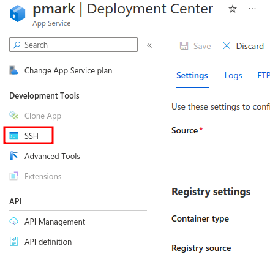
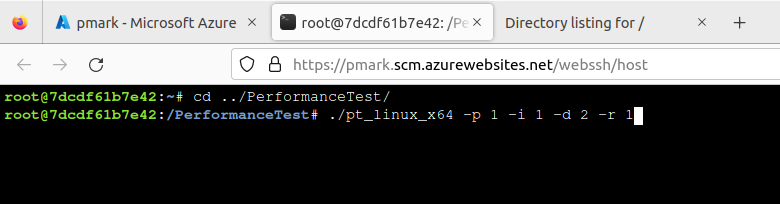
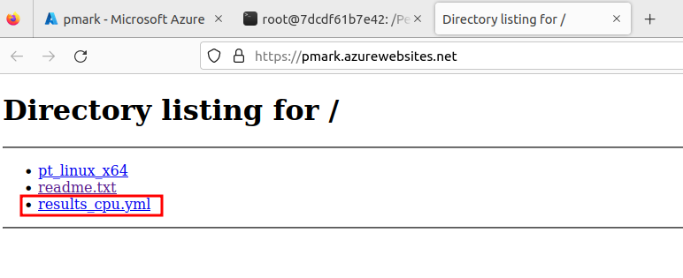

# docker-passmark

Test Image for running [Passmark](https://www.passmark.com/support/pt_linux_faq.php)

[https://hub.docker.com/r/andif888/docker-passmark](https://hub.docker.com/r/andif888/docker-passmark)

## Testing

### Run container

```bash
docker run -d \
--cap-add=sys_rawio \
--device=/dev/mem:/dev/mem \
--publish "80:80" \
--name pmark \
andif888/docker-passmark:latest
```

### Run a command in a running container

```bash
docker exec -it pmark /bin/bash
```
### Run passmark inside container

```bash
/PerformanceTest/pt_linux_x64 -p 1 -i 1 -d 1 -r 1
```

## Azure App Service

### Azure App Service Config

Azure App Service Config using [docker-compose.yml](docker-compose.yml)



### SSH into Azure App Service

locate and click `SSH` in left menu; click `Go`



### Run Passmark inside container

cd into `../PerformanceTest`directory and run `./pt_linux_64 -p 1 -i 1 -d 1 -r 1`



### Download Passmark Results

download passmark result directly from the App Service URL




